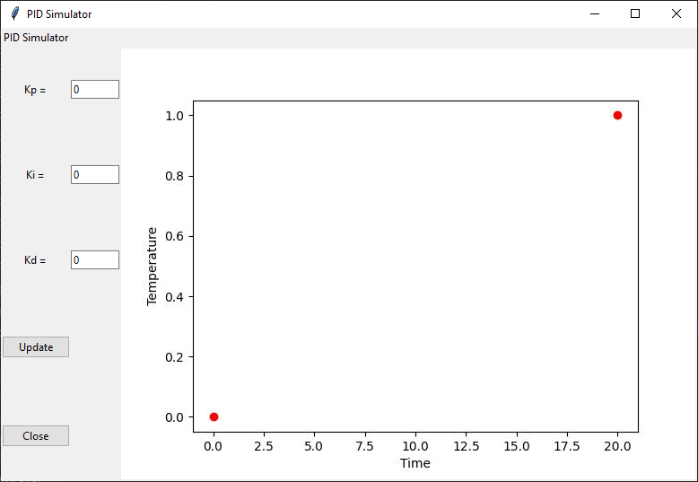
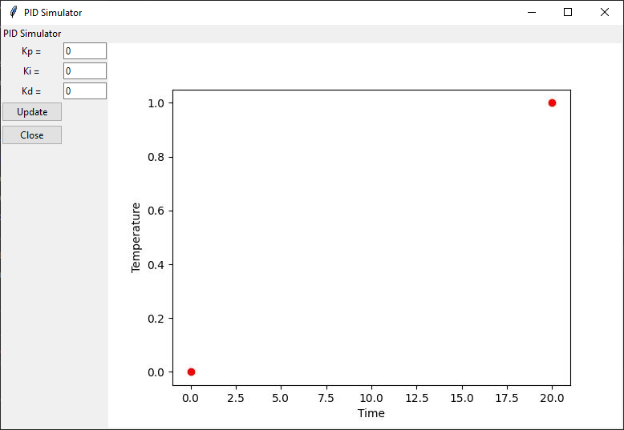

# Graphical User Interfaces (GUIs) in Python

## General 

For this workshop, we will be learning how to create a GUI in Python by 
writing code in a module, rather than in a Jupyter Notebook.  

GUIs are typically "event" driven programs where the program responds to events
 or actions by the user.  Typical program flow is as follows:
1) The program creates the interface and displays initial information to the
    user.
2) The program then waits for the user to interact with the GUI in some 
    fashion.  This could be clicking a button, entering text in a field,
    moving the mouse, dragging a scroll bar, making a choice from a menu, etc.
3) When the user takes some sort of action in the GUI, that action or event
    triggers a function of the program to run, do whatever actions are needed,
    and then update the GUI for the user to see the results.
4) Repeat steps 2 and 3.

## GUI Options for Python
There are a large number of GUI packages for use with Python.  Most are a set 
of Python bindings to an underlying graphics package that often provides
support for multiple platforms.

The GUI package that is bundled with the default Python installation is called
[tkinter](https://docs.python.org/3/library/tk.html). Tkinter is an interface
to the [Tk](https://en.wikipedia.org/wiki/Tk_(software)) open-source, 
cross-platform GUI toolkit.  This workshop will cover using this GUI system.

Another popular choice for GUIs in Python is 
[PyQt](https://www.riverbankcomputing.com/software/pyqt/intro), an interface
to the [Qt](https://www.qt.io/) GUI system.  PyQt provides a more modern
look and feel, but has a steeper learning curve and requires a paid license
if used in any commercial software.

## Widgets
The building blocks for making a GUI are known as widgets.  Pretty much every
part of the GUI is considered a widget:  windows, buttons, checkboxes, radio
buttons, labels, etc.  You construct the GUI by adding widgets to the interface
and then defining the behavior of those widgets.

Let's step through the process of making a GUI that demonstrates the response
of a PID controller.  Create a blank file called `pid_controller.py`. 

## Importing `tkinter`
While `tkinter` is a standard package within Python, it needs to be imported
into your module.
```python
import tkinter as tk      # Importing standard tkinter as the "tk" alias
from tkinter import ttk   # Importing newer "themed" widgets as the "ttk" alias
```
The "themed" widgets in the `ttk` submodule are more modern looking and have
better confirmation to individual platform standards in terms of style and
appearance.

## `Tk` Root Window Widget
The starting point for the GUI is a top lever, root window and is created
using the `tk.Tk` class.  Enter the following code into your module:
```python
def main_window():
    root = tk.Tk()
    root.mainloop()

main_window()
```

We will define the GUI within a function called `main_window`.  We first create
the root window using the `tk.Tk()` constructor and assign it to a variable
name.  This variable name can be used to refer to the wiindow widget.  To start 
and display the GUI, we call the `.mainloop` method of the root window.  A 
blank window should be displayed.


The Python program is still running.  The `.mainloop` method call starts the
main GUI loop and the GUI is waiting for some sort of action to implement the
next step.  Since we don't have any widgets or any defined actions, nothing
will happen.  Close the window and then the program will end because there are
no further commands after the `.mainloop()` call.

There are some methods we can use to modify this window.  We can give it a
title by entering
```python
    root.title("PID Simulator")
```
Make sure to include this line before the `.mainloop()` call, or else it will
not take effect before the GUI starts.

By default, `tkinter` will size the window to fit whatever widgets are put 
into it.  But, if you want to specify a specific size for the window, you can
do so with the `.geometry` method which takes a string parameter containing
the width and height in pixels as shown in this example.
```python
    root.geometry("600x50")
```


You must be careful when setting the window size because if you add too many
widgets, they might not all fit inside the window.  So, for now, do not
use the `.geometry` method.

## Placing Widgets Using the Grid Manager
There are a variety of different ways that widgets can be added to a window.
How they are arranged in the window is controlled by a geometry manager.
There are three geometry managers in `tkinter`:  `grid`, `pack`, and `place`.
I strongly prefer the `grid` manager as it gives you the easiest control over
where widgets will display on the GUI while still also allowing the manager
to handle some of the basic repositioning tasks.  So, I will be focusing on 
the `grid` method.

When using the `grid` manager, it is often a good idea to first sketch out your
GUI so we can see where all the different widgets will need to be on the grid.


Then, we put a grid on top of the sketch:


In the next sections, we will add the different widgets to the grid.

## Label Widget
Text to display on the GUI is done through a `Label` widget.  Let's put the 
PID Simulator title on.
```python
    title_label = ttk.Label(root, text="PID Simulator")
    title_label.grid(column=0, row=0)
```
Put these lines in the `main_window` function before the `root.mainloop()` 
call.  

All widget constructors (except the `tk.Tk` widget) take as their first 
parameter the parent widget into which the new widget should be placed.  In 
this example, we are putting the label widget into the root window, so `root` 
is given as the first parameter.

The `ttk.Label` class takes a named parameter called `text` that contains a 
string with the text to be displayed.  This first line above creates the widget
and the second line uses the `.grid` method to place it on the grid of the
parent widget, which is the root window.  We want
this label to display in column 0 and row 0 per the sketch above, so those
named parameters are used to set the location.  (We will cover the fact that
the label spans two columns later).  When running the program, our window now
looks like this:


Notice the window is now smaller and is sized to fit the only widget in the 
window.  It will grow as we add more widgets.

Next, add the labels for the three variable inputs.

```python
    kp_label = ttk.Label(root, text="Kp =")
    kp_label.grid(column=0, row=1)
    ki_label = ttk.Label(root, text="Ki =")
    ki_label.grid(column=0, row=2)
    kd_label = ttk.Label(root, text="Kd =")
    kd_label.grid(column=0, row=3)
```


## Entry Widget
A `ttk.Entry` widget is used to accept user input from the keyboard.  A 
special variable class of `tk.StringVar` (for text) or `tk.IntVar` (for 
numbers) is needed to store the value entered into the entry box.  Here is an 
example:
```python
    kp_value = tk.IntVar()
    kp_entry = ttk.Entry(root, textvariable=kp_value)
    kp_entry.grid(column=1, row=1)
```
The first line above creates the variable containing the `IntVar` class which
will hold the value entered in the entry box.  The second line creates the
`ttk.Entry` widget.  We connect this widget to the `IntVar` variable using the
`textvariable` named parameter.  Finally, we put the entry box on the grid.
The window will now look like this:


The entry box doesn't need to be this wide, so its width can be modified using
the `width` named parameter that defines the width as the number of characters
to display.  So, the `ttk.Entry` creation can be changed to:
```python
    kp_entry = ttk.Entry(root, textvariable=kp_value, width=8)
```


The other entry boxes are made similarly:
```python
    ki_value = tk.IntVar()
    ki_entry = ttk.Entry(root, textvariable=ki_value, width=8)
    ki_entry.grid(column=1, row=2)
    kd_value = tk.IntVar()
    kd_entry = ttk.Entry(root, textvariable=kd_value, width=8)
    kd_entry.grid(column=1, row=3)
```


## Button Widget
The `ttk.Button` widget provides a button which the user of the GUI can click.
```python
    update_btn = ttk.Button(root, text="Update")
    update_btn.grid(column=0, row=4)
```


Right now, if I click on this button, nothing happens.  We need to define
a function to run when the button is clicked.  And, since we will want this
function to have access to the variables of the GUI, we will define this 
new function as a "sub-function" of the `main_window` function.  For example:

```python
def main_window():

    def update_cmd():
        print("Clicked on Update Button")

    root = tk.Tk()
    root.title("PID Simulator")
    ...
```
The sub-function is indented to indicate it belongs in the `main_window`
scope.  

Now, we connect this function to the button by using the `command` named
parameter.
```python
    update_btn = ttk.Button(root, text="Update", command=update_cmd)
```
**NOTE**: it is very important that you do not include `()` after the function
name when assigning it to the command parameter.  If you do have a `()`, the 
`update_cmd` function will run and anything it returns will be assigned to 
the `command` parameter.

Now, when you run the GUI and click on the "Update" button, the line "Clicked
on Update Button" should display in the console output.  We will add more to 
this function later.

### Closing window with `.destroy` method
Let's create another button that can close the window.  First, we create the
button:

```python
    close_btn = ttk.Button(root, text="Close", command=close_cmd)
    close_btn.grid(column=0, row=5)
```

and then we define the function that is called when the Close button is
clicked:
```python
    def close_cmd():
        root.destroy()
```
The `.destroy` method removes/destroys the widget.  If this is the root window,
the GUI mainloop ends.

## Images using Label Widgets
The `ttk.Label` widget can also be used to display an image.  So, let's add an
image of plot to our GUI.  The file `blank_plot.jpg` contains an image that
can be used.  First, we need to load this image into our program.  This can be
done using a package called `pillow`.  The following `import` statement will
import the needed functionality from `pillow`.  

```python
from PIL import Image, ImageTk
```
(*Note*: If you are curious why we are importing from `PIL` and not `pillow`, 
the `pillow` package is a fork of the `PIL` package and `pillow` still uses the 
`PIL` name for the import.)

We import the image file into the Python program using the `Image.open`
function that we imported from `pillow`.

```python
image = Image.open("blank_plot.jpg")
```
Next, this `image` needs to be converted to a tk-compatible format.  That is
done with this command:
```python
tk_image = ImageTk.PhotoImage(image)
```
Now, a `ttk.Label` can be created that uses this tk-compatible image.

```python
    im_label = ttk.Label(image=tk_image)
    im_label.image = tk_image
```
Instead of using the `text` named parameter when creating the `ttk.Label`, we
use the `image` named parameter.  Depending on how a program is designed, the
`tk_image` variable may be susceptible to removal by Python's garbage 
collection if variable scope changes.  If this happens, the image will not
display properly.  To prevent that from occurring, the second line above saves
the image found at `tk_image` as part of the label itself.  So, as long as the
label exists, the image data will exist.

Finally, we put the Label on the grid using
```python
    im_label.grid(column=2, row=1)
```

The window now looks like this:  


## Column and Row Spanning
The layout is not very pleasing.  It has put the entire plot in row 1, making
it very tall while the other rows remain shorter.
If we look at our sketch of the GUI with the
grid, we would like for the plot to span across rows 1 through 5.  We can do
this by adding the `rowspan` named parameter to the `.grid` method and 
indicating how many rows we want this widget to span across.  Change
the `.grid` call of the `im_label` as follows:
```python
    im_label.grid(column=2, row=1, rowspan=5)
```



Now, the plot spans across rows 1 through 5, with each row now being taller
to accommodate the plot across the rows.  I would still like the inputs and 
buttons on the left to be more compact.  An easy way to do this is to have
the plot span across additional rows.

```python
    im_label.grid(column=2, row=1, rowspan=99)
```



With this method, you may need to do further adjustments to the `rowspan` if 
you add widgets to new rows in the future.  A more elegant solution would be
to use the `Frame` widget and put all of the labels, entries, and buttons into 
a frame that could be put in column=0, row=0 and then have the plot in
column=1, row=0.  The frame would have a separate grid manager for arranging
its widgets that would not interact with the plot.  See the section below
about Frames for implementation details.

Next, we'd like the buttons to span across columns 0 and 1, so we will use the
`columnspan` named parameter.
```python
    update_btn.grid(column=0, row=4, columnspan=2)
```
If we make a similar change for the `close_btn.grid` call, we get the
following:


## `sticky` for Widget Alignment
In the GUI, there is now a gap between the "K=" labels and the entry box.  It
would be better if the labels were adjacent to the entry box.

By default, the grid manager centers a widget inside its cell.  But, we can
override that behaviour by using the `sticky` named parameter in the `.grid`
call.  `sticky` takes a string value that indicates the direction of which
you want the widget to move in the cell.  So, if you want the widget to be
on the right side of the cell, you use the string value `"e"` for east.
```python
    kp_label.grid(column=0, row=1, sticky="e")
```
If we make similar changes for all of these labels, the GUI now looks like
this:


Other directions could be "w", "n", "s", "ne", "sw", etc.  There are also
`tk` defined constants that can be used instead.  For example, `tk.N`, `tk.E`,
`tk.SW`, etc.

Finally, let's move the "PID Simulator" label over so its spans columns 0 
and 1.  That change would be:
```python
    title_label.grid(column=0, row=0, columnspan=2)
```

## Getting info from GUI
When the user clicks the "Update" button, the `update_cmd` function
runs.  Currently, this function simply prints a statement to the console. What
we want this function to do is get the values for Kp, Ki, and Kd from the 
interface, generate a plot that shows the PID simulation based on these inputs,
and then show that plot in the window.

To get the inputs for Kp, Ki, and Kd, we use the instances of the `tk.IntVar`
class found in the variables `kp_value`,`ki_value`, and `kd_value`.  To get
their values, we must use the `.get` method of the class.  So, modify the
`update_cmd` function as follows:

```python
    def update_cmd():
        print("Clicked on Update Button")
        # Get information from GUI
        kp = kp_value.get()
        ki = ki_value.get()
        kd = kd_value.get()
```
These three new lines will get the value from the `IntVar` class instance that
is connected to the appropriate entry box.  

Next, we need to send this information from the GUI to a function that does
the "work" of the program.  In this case, I have written a simple module that
takes the three PID input variables and then calculates the time response of a
simple system (a heater with PID control implementing a step change in target
temperature of a sample) and returns an image object containing a graph of this
time response.  The module is called `pid_calculations.py` and the function to
be called is `generate_PID_plot`.

At the top of your `pid_controller.py` module, include this `import` statement.
```python
from pid_calculations import generate_PID_plot
```
Next, add the following line to the `update_cmd` function.
```python
        plot_image = generate_PID_plot(kp, ki, kd)
```
The `plot_image` variable now contains a tk-compatible image that we can put 
into the `im_label` we have already created.  Add these lines to the 
`update_cmd` function.
```python
        im_label.configure(image=plot_image)
        im_label.image = plot_image
```
The image will now be updated with a new plot based on the PID constants.


## Changing colors of widgets
To change the color and other aspects of the appearance of a widget, you 
need to use ttk.Styles 
(<https://docs.python.org/3/library/tkinter.ttk.html#ttk-styling>).

The use of these styles allows us to easily change the appearance of many
widgets at once.  However, it is not a straightforward process.  If changing
the colors of a widget is important, and you don't mind giving up a bit of 
the more "modern" look, I would use the`tk` version of the widget instead,
which has much easier access to changing colors.

For example, the `ttk.Button` widget does not have any option to change the 
primary background color away from the operating system default color (grey
for Windows).  There is a `background` parameter that can be changed, but it
only changes the border color.

The button class could be changed to the `tk.Button` class as follows:
```python
update_btn = tk.Button(root, text="Update", command=update_cmd,
                           background="blue", foreground="white")
```
Now, the colors can be more easily changed using the `background` and 
`foreground` named parameters for `tk.Button`.  

This change causes the button width to decrease relative to the `ttk.Button`.
This can be fixed by modifying the `.grid` call to use the `sticky` named
parameter to tell the widget size to expand to the "east" and "west" sides of
the grid cell.  Now the button will go right up to the edges of the column.  
But, it is nicer to have a little bit of a gap, so the `padx` named parameter
is used to specify the number of pixels that should exist between the left and
right edges of the cell and the widget.
```python
update_btn.grid(column=0, row=4, columnspan=2, sticky="ew", padx=5)
```
When similar changes are made to both buttons, the GUI now looks like this:


## Frames
Frames are widgets that can be added to a grid.  Then, child widgets can be
added to the frame using a separate grid manager for the frame.  In this way,
groups of widgets can be arranged and move together relative to other widgets
or groups of widgets.  The frame can have a border for visual organization, if
desired.  The code below shows how the GUI above could be reorganized using
frames.  Note that when you are adding a widget to a frame, you specify the
frame variable as the parent.

```python
    # Create a frame and add it to the first column of the root window grid
    frame = ttk.Frame(root)
    frame.grid(column=0, row=0, sticky="n")

    # Create and add widgets to the frame using the frame grid manager 
    title_label = tk.Label(frame, text="PID Simulator")
    title_label.grid(column=0, row=0, columnspan=2)
    kp_label = ttk.Label(frame, text="Kp =")
    kp_label.grid(column=0, row=1, sticky="e")
    ki_label = ttk.Label(frame, text="Ki =")
    ki_label.grid(column=0, row=2, sticky="e")
    kd_label = ttk.Label(frame, text="Kd =")
    kd_label.grid(column=0, row=3, sticky="e")

    kp_value = tk.IntVar()
    kp_entry = ttk.Entry(frame, textvariable=kp_value, width=8)
    kp_entry.grid(column=1, row=1)
    ki_value = tk.IntVar()
    ki_entry = ttk.Entry(frame, textvariable=ki_value, width=8)
    ki_entry.grid(column=1, row=2)
    kd_value = tk.IntVar()
    kd_entry = ttk.Entry(frame, textvariable=kd_value, width=8)
    kd_entry.grid(column=1, row=3)

    update_btn = tk.Button(frame, text="Update", command=update_cmd,
                           background="blue", foreground="white")
    update_btn.grid(column=0, row=4, columnspan=2, sticky="ew", padx=5)

    close_btn = tk.Button(frame, text="Close", command=close_cmd,
                           background="blue", foreground="white")
    close_btn.grid(column=0, row=5, columnspan=2, sticky="ew", padx=5)

    # Create the image label and add it to column 1 of the root window grid
    image = Image.open("blank_plot.jpg")
    tk_image = ImageTk.PhotoImage(image)
    im_label = ttk.Label(root, image=tk_image)
    im_label.image = tk_image
    im_label.grid(column=1, row=0)

```

## References
<https://tkdocs.com/tutorial/>  -  An excellent tutorial for using Tk.  You can
specify that you want to learn in Python and it will show the code using 
`tkinter`.  It also has some links to good documentation.

<https://anzeljg.github.io/rin2/book2/2405/docs/tkinter/index.html> - 
Comprehensive documentation for `tkinter`.  A few years old and written for 
Python 2.7, so some
syntax may be slightly different, but has good description of all of the
options and configurations for many of the `tkinter` widgets.

<https://docs.python.org/3/library/tkinter.ttk.html> - Official Python
documentation on the `ttk` themed widgets.

<https://www.kite.com/python/docs/tkinter> - A not-terribly user friendly
reference guide for `tkinter`, but does seem to have good lists of all
methods, arguments, and keywords for all the widgets.

<https://www.riverbankcomputing.com/static/Docs/PyQt5/index.html> - 
documentation for PyQt5

<http://zetcode.com/gui/pyqt5/introduction/> - a tutorial for using PyQt5

<https://pythonspot.com/pyqt5/> - another tutorial for using PyQt5
