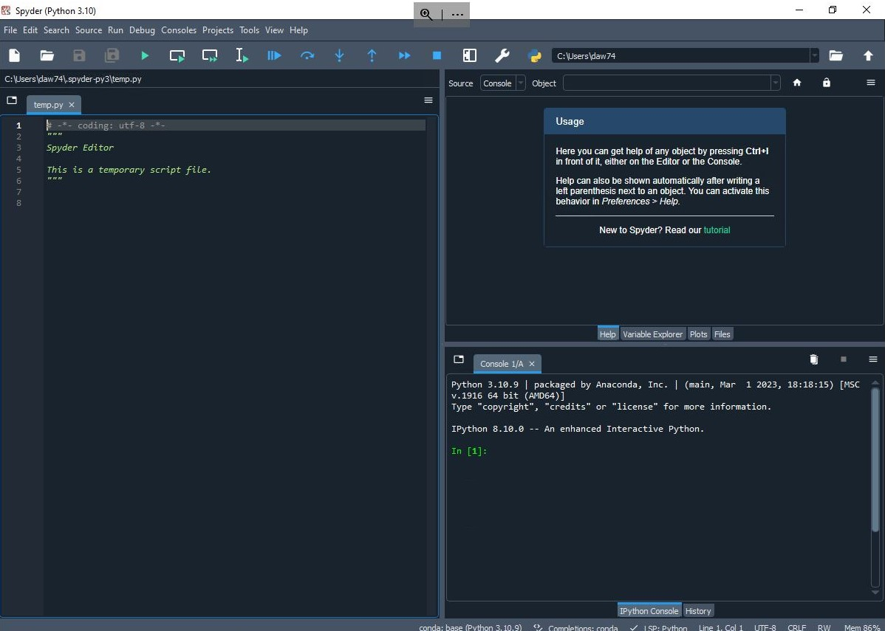

# Getting Started with Spyder

_Note:_ All the instructions below were developed in Windows 10.  The steps 
may differ for different operating systems.

## Installation
If you haven't already installed Anaconda, follow these steps.
1. Visit <https://www.anaconda.com/download>.
2. Download the appropriate version for your operating system.
3. Run the downloaded installer if it doesn't start automatically.
4. Step through the installation steps using the recommended settings.

## Using Spyder
After you start Spyder, you will see a screen like this:

You can enter your code in the left panel.  The upper right panel is used to
examine certain outputs and variable contents during debugging.  The lower
right panel will show any text output from your code.

Example:  
1.  Enter the following code.
    ```python
    section_1_students = 20
    section_2_students = 12
    total_students = section_1_students + section_2_students
    print("The total number of students is {}.".format(total_students))
    ```
2. Save the file
3. Run the script by clicking on 
    in the toolbar.
4. You will see the output in the lower right panel.

## Debugging
You can run your code and step through it line by line using the debugger.

1. The first time you use the debugger, modify the debugger settings as follows:
   + Select `Preferences` from the `Tools` menu.
   + In the `Preferences` window, select `IPython console` in the left pane.
   + Select the `Debugger` tab in the right pane.
   + Make sure the "Ignore Python libraries while debugging" checkbox is selected.
2. Start the debugger by clicking on this icon in the toolbar:  
    
3. A blue arrow will appear in the margins of the code to indicate where you
    are in the program.  Click the "Step Into" icon, ,
    to move to the next line.
4. The value of each variable will be shown in the upper right panel.
5. If you want the program to run to a particular place and then stop, you can
    set a breakpoint by clicking next to the line number in the left margin
    of the line at which you want to stop.  Then, click the 
     and the program will
    run and then stop at the breakpoint.